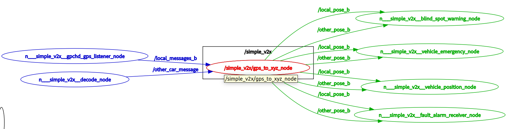
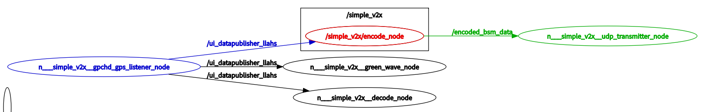
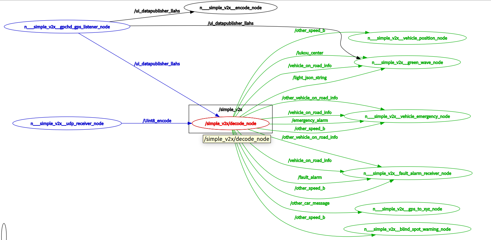

<!-- ### 1.介绍开发的功能  

### 2.开发的步骤    
- 新启动一个dockerB，在我原有的dockerA中只启动基础的ros2节点，给二次开发dockerB提供话题接口 -->

# V2X场景开发

## 简介

v2x场景2.0版本模块的二次开发目的是为了给客户提供传感器数据接口以及传感器数据处理接口，客户根据自己的研发需求可将自己开发的代码接入传感器数据，实现v2x场景模块代码功能的测试及修改。

**注意：所有代码的源码编辑及修改都是在宿主机（docker外进行），代码的编译及终端进行的所有操作都在docker内进行。**

## 1. 系统架构概述

本系统基于ROS2架构实现车联网(V2X)功能,
主要包含以下核心模块:
- GPS数据处理模块(gps_to_xyz)
- 消息解析模块(obu_json)
- 场景决策模块(position_determination)

其部分节点图如下所示：

上图主节点为 `/gps_to_xyz、/encode、/decode`，其中`/gps_to_xyz`节点负责将GPS数据转换为ROS2标准消息格式，`/encode`节点负责将传输数据编码为ASN.1格式，`/decode`节点负责将ASN.1格式数据解码为ROS2标准消息格式。

## 2. 系统模块信息

### 2.1 GPS数据流

主要为`gps_listener_node` 、 `gps_to_xyz` 节点，功能如下

- 通过TCP/串口接收GPS原始数据
- 发布位置、航向角、速度等信息
- 将GPS数据转化为本地坐标系下的坐标

`gps_to_xyz`节点的订阅段和发布端信息如下：

### 订阅端

话题        | 话题名    |   消息类型
-------    | :------: |:---------
自车 GPS 消息  | /local_messages | gps_msgs/msg/GPSFix
远车 GPS 消息  | /other_car_message | gps_msgs/msg/GPSFix

### 发布端

话题        | 话题名    |   消息类型
-------    | :------: |:---------
自车本地笛卡尔坐标 | /local_pose | geometry_msgs/msg/PoseStamped
远车本地笛卡尔坐标  | /other_pose | geometry_msgs/msg/PoseStamped

### 2.2 V2X消息流与场景的判断

v2x消息流主要为`encode_node` 、 `decode_node` 、`obu_handle_node`节点，场景判断主要为`vehicle_position_node`、`blind_spot_warning_node` 、 `emergency_vehicles_node` 、 `fault_alarm_receiver_node` 、 `green_wave_node` `、intersection_collision_warning_node` 等，功能如下

- OBU设备接收发布V2X消息
- ASN.1消息编解码
- 信息提取(车道、红绿灯等)
- 场景的触发条件判断

`encode_node` 节点的作用是将GPS数据以及车辆事件信息编码成ASN.1格式的BSM消息并发布。`encode_node` 节点的订阅端和发布端信息如下：

### 订阅端

话题        | 话题名    |   消息类型
-------    | :------: |:---------
接收GPS信息  | /ui_datapublisher_llahs | gps_msgs/msg/GPSFix
车辆异常状态  | /vehicle_event_fault | std_msgs/String
车辆紧急状态  | /vehicle_emergency | std_msgs/String

### 发布端

话题        | 话题名    |   消息类型
-------    | :------: |:---------
ASN.1 | /encoded_bsm_data | std_msgs/UInt8MultiArray

`decode_node` 的主要功能是接收并解码ASN.1编码的数据，从中提取地图信息、交通灯信息和其他车辆信息（包括位置、速度、航向、故障和紧急状态等），并将解码后的信息发布到不同的主题，供其他节点使用。 它也订阅本车的GPS信息，用于判断车辆位置和发布车辆到达路口的信息。`decode_node`节点的订阅端和发布端信息如下：

### 订阅端
话题        | 话题名    |   消息类型
-------    | :------: |:---------
接收编码后的 ASN.1 数据  | /Uint8_encode | std_msgs/UInt8MultiArray
接收GPS信息  | /ui_datapublisher_llahs | gps_msgs/msg/GPSFix

### 发布端

话题        | 话题名    |   消息类型
-------    | :------: |:---------
十字路口信息	|/Vehicle_Map_Intersection	|std_msgs/msg/String
车辆所在道路信息	|/vehicle_on_road_info	|std_msgs/msg/String
其他车辆所在道路信息	|/other_vehicle_on_road_info	|std_msgs/msg/String
十字路口中心点经纬度	|/lukou_center	|std_msgs/msg/String
其他车辆位置信息	|/other_car_message	|gps_msgs/msg/GPSFix
其他车辆速度信息	|/other_speed_b	|geometry_msgs/msg/Twist
交通灯信息	|/light_json_string	|std_msgs/msg/String
故障报警	|/fault_alarm	|std_msgs/msg/String
紧急报警	|/emergency_alarm	|std_msgs/msg/String

## 3. 模块开发说明 

<!-- 可对 /home/promote/vehicleToEverything/pm_v2x/src/position_determination 的  -->

v2x场景模块的二次开发主要在/home/promote/vehicleToEverything文件夹下的sec_dev文件夹内进行。

首先进入sec_dev文件夹创建自己的工作空间，然后在工作空间内开发自己的功能包。

由于docker外面sec_dev文件夹和docker内部采用共享文件夹的形式，所以外面修改了代码，对应的docker内部也进行了相应的修改。代码修改完成后接下来所有的在终端的操作都要进入到docker内部执行。

二次开发工作，主要流程包含以下三步：

### 3.1 传感器启动及传感器数据源查看

